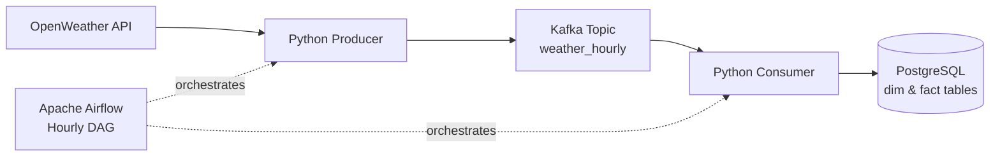

# Weather Data Pipeline (Kafka, Airflow, PostgreSQL)

## 1. Problem Statement

Collecting and storing weather data from multiple global locations on an hourly basis requires a data pipeline that is **reliable**, **idempotent**, and **easy to scale**. A naive approach (direct API → database) often leads to duplicated data, tight coupling, and difficulties when reprocessing or retrying jobs.

This project demonstrates how to design and implement a **production-shaped data pipeline** that decouples ingestion from persistence, supports retries, and models data in an analytics-friendly way.

---

## 2. High-Level Architecture

**Technology stack:**

* **Python** – data ingestion and processing logic
* **OpenWeather API** – data source
* **Apache Kafka** – event streaming and decoupling
* **Apache Airflow** – orchestration and scheduling
* **PostgreSQL** – analytical storage
* **Docker** – local infrastructure

**Architecture flow:**

```
OpenWeather API
      ↓
Python Producer
      ↓
   Kafka Topic
      ↓
Python Consumer
      ↓
 PostgreSQL
 (dim & fact tables)
```

Airflow is used purely as an **orchestrator** to trigger the producer and consumer on an hourly schedule. All business logic lives in standalone Python scripts.



---

## 3. Data Modeling

The database follows a **dimensional model** to separate descriptive attributes from time-series measurements.

### 3.1 Dimension Table: `dim_location`

Stores unique geographic locations.

**Business key:** `(latitude, longitude)`

Columns:

* `location_id` (surrogate key)
* `latitude`
* `longitude`
* `city`
* `country`
* `region` (optional / future enrichment)
* `created_at`

This design ensures that each physical location is stored exactly once, even if weather data is ingested multiple times.

---

### 3.2 Fact Table: `fact_weather_hourly`

Stores hourly weather observations.

Columns:

* `location_id` (FK → `dim_location`)
* `timestamp`
* `temperature_c`
* `humidity`
* `precipitation`
* `wind_speed`
* `data_source`
* `ingestion_time`

A **unique constraint on `(location_id, timestamp)`** guarantees idempotency.

---

## 4. JSON Contract (Kafka Message Schema)

Each Kafka message represents **one weather observation for one location**.

```json
{
  "location": {
    "latitude": -6.2146,
    "longitude": 106.8451,
    "city": "Jakarta",
    "country": "ID"
  },
  "weather": {
    "timestamp": "2026-01-20T07:32:52",
    "temperature_c": 303.16,
    "humidity": 72,
    "wind_speed": 4.08,
    "precipitation": 0.59
  },
  "metadata": {
    "data_source": "openweather"
  }
}
```

This contract cleanly separates:

* **Location (dimension)**
* **Weather measurements (fact)**
* **Operational metadata**

---

## 5. Producer Design

The producer:

* Iterates over a predefined list of locations (5 cities across Asia and Europe)
* Calls the OpenWeather API using **latitude and longitude** (deterministic identifiers)
* Builds a clean JSON contract
* Sends **one Kafka message per location**

Key design choices:

* The producer is **stateless**
* No database access
* No deduplication logic

---

## 6. Consumer Design

The consumer:

1. Reads messages from Kafka
2. Parses the JSON contract
3. Looks up `(latitude, longitude)` in `dim_location`

   * Inserts a new row if the location does not exist
4. Inserts a record into `fact_weather_hourly`

   * Uses `ON CONFLICT DO NOTHING` to guarantee idempotency

This ensures that:

* Re-running the pipeline does not create duplicates
* Kafka replays are safe
* Airflow retries are safe

---

## 7. Orchestration with Airflow

Airflow is used **only for orchestration**, not for data processing.

The DAG:

* Runs on an **hourly schedule**
* Executes:

  1. `weather_producer.py`
  2. `weather_consumer.py`

Key principles:

* No heavy logic in DAGs
* Scripts are runnable independently
* Clear task dependencies

---

## 8. Reliability & Idempotency

This pipeline is designed to be safe under retries and failures:

* **Kafka** decouples ingestion from persistence
* **Consumer groups & offsets** prevent duplicate reads
* **Database constraints** enforce data uniqueness
* **Airflow retries** can be enabled without risk

---

## 9. Results Example

After one pipeline run:

* `dim_location`: 5 rows (one per city)
* `fact_weather_hourly`: 5 rows (one per city per hour)

Subsequent runs:

* Insert new hourly records
* Never duplicate existing data

---

## 10. Future Improvements

Possible extensions:

* Add `region` enrichment (e.g., Southeast Asia, Europe)
* Introduce Schema Registry for versioned message schemas
* Add monitoring & metrics
* Store historical forecasts using a separate fact table

---

## 11. Summary

This project demonstrates how to design a **real-world, production-shaped data pipeline** using modern data engineering tools. The focus is not only on making the pipeline work, but on making it **reliable, maintainable, and explainable**.

---

**Author:** Avesina

